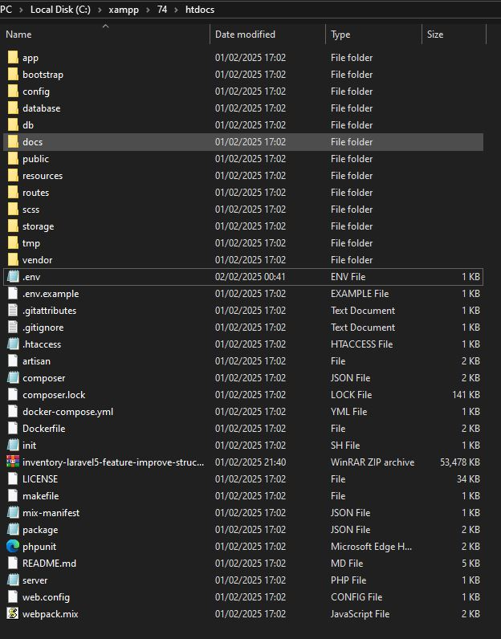

## Project Inventory Laravel 5
This project is based on [INVENTORY](https://www.youtube.com/watch?v=dqBLvR7lC8k) and has been adapted for easier installation in environments such as XAMPP, cPanel, and Docker. Adjustments have been made to optimize deployment and compatibility, ensuring a more accessible experience for various use cases.

## Installation

* [Docker installation](#Docker-installation)
* [Cpanel installation](#Cpanel-installation)
* [Xampp installation](#Xampp-installation)

## Docker installation

### Requirements

Your system needs the following programs:
* Docker
* Docker Compose
* Make

### Steps

Clone the project from the repository url.
```shell
git clone <repository url>
```

Enter the directory.
```shell
cd <directory name>
```

Before running the make commands, you need create a new docker network using the name "inventory_laravel5".
<br>
If you need change de network name, then you need modify the network in docker compose file.
```shell
docker network create inventory_laravel5
```

Run `make build` command to build the images for app and db containers.
```shell
make build
```

Run `make up` command to up the containers if the containers are not active.
```shell
make up
```

Run `make db.migrate container=<db_container_name>` command to migrate database information.
<br>
If you need change container name, then you need modify the name in docker compose file.
```shell
make db.migrate container=inventory_db
```

Run `make npm.install container=<db_container_name>` command to install npm dependencies
```shell
make npm.install container=inventory
```

### Makefile
If you need more information about `make` commands for this project, then you need review the Makefile file in this repository.

### Observations
If you are using a 'Windows' operating system, please note that sometimes there may be an issue with networks. Therefore, before creating a new network, you will need to run the following command.
```shell
docker network prune
```
The above command delete all networks.

## Cpanel installation
This files does not need any modification, it includes an .htaccess file for the correct functioning of the routes without needing to alter the structure of the original project.

* Download and import this repository content in your `public_html` directory.
* Import database using the inventory.sql file from `db` directory to your cpanel database.
* In your cpanel set the php version to 7.4. Preferably version ea-7.4 (EasyApache 4).
* Copy the .env.example file and rename it to .env. Then, update the credentials and settings according to your environment.

For production mode set `APP_DEBUG` in `false`

```dotenv
APP_NAME=Inventory
APP_ENV=local
APP_KEY=base64:yru13Kb0wYKh81NezXu2mR9efx33PrawOgfhQ7XcGKM=
APP_DEBUG=true
APP_LOG_LEVEL=debug
APP_URL=https://yourdomain.site

DB_CONNECTION=mysql
DB_HOST=localhost
DB_PORT=3306
DB_DATABASE=pcajkuwd_inventory
DB_USERNAME=pcajkuwd_root
DB_PASSWORD=Xl34c574B@3L
```

## Xampp installation
The project configuration only allows installation in the htdocs folder and not in child folders.
<br>
This project only works with version 7.4 of XAMPP. It is recommended to download XAMPP with PHP version 7.4.

* Download and import this repository content in your `htdocs` directory.
* Import database using the inventory.sql file from `db` directory to your phpmyadmin database.
* Copy the .env.example file and rename it to .env. Then, update the credentials and settings according to your environment.

```dotenv
APP_NAME=Inventory
APP_ENV=local
APP_KEY=base64:snRgYbevQFPo68EIDKeUuOTvA1vW3D/M/rm1/8mqC00=
APP_DEBUG=true
APP_LOG_LEVEL=debug
APP_URL=http://localhost/

DB_CONNECTION=mysql
DB_HOST=localhost
DB_PORT=3306
DB_DATABASE=inventory
DB_USERNAME=root
DB_PASSWORD=
```
* The result of your project structure is like:
  <br> 

* Run the URL in your web browser `http://localhost`.
* Don't forget the new credentials:
  * Email: `admin@inventory.org`
  * Password: `root`
* Enjoy it!
